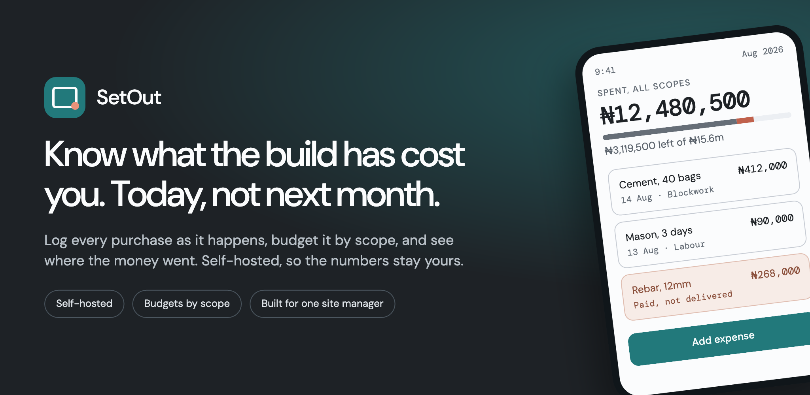

<p align="center">
  
</p>

<h1 align="center">Setout</h1>

<p align="center">Know what the build has cost you. Today, not next month.</p>

<p align="center">
  <a href="https://github.com/bolorundurovj/setout/actions/workflows/ci.yml"></a>
  <a href="https://github.com/bolorundurovj/setout/releases"></a>
  <a href="https://github.com/bolorundurovj/setout/pkgs/container/setout"></a>
  <a href="https://hub.docker.com/r/bolorundurovj/setout"></a>
  <a href="LICENSE"></a>
</p>

<p align="center">
  
</p>

Setout is a self-hosted web app for tracking construction expenses on personal building projects. It replaces a spreadsheet whose budget figures were entered after the money was spent. In Setout a budget belongs to a category and is set deliberately. An expense records spending and can never write a budget value.

- Backend: Python, FastAPI, Tortoise ORM (with its built-in migration CLI).
- Frontend: Angular, consuming a TypeScript SDK generated from the OpenAPI schema.
- Database: SQLite by default, Postgres optional.
- Deployment: one container, one port, SQLite by default.

See the product in action in the [full showcase](docs/showcase.md).

## Quick start

With Docker:

```bash
docker compose -f docker/docker-compose.yml pull
docker compose -f docker/docker-compose.yml up -d
```

That pulls the published image, `ghcr.io/bolorundurovj/setout` for amd64 and
arm64, and brings up the app on 8474 with Postgres for the database and MinIO for attachments. The same image is on Docker Hub as `bolorundurovj/setout` if you
would rather pull from there. From a checkout instead:

```bash
make setup    # install backend and frontend
make dev      # run the API and the web app together
```

Open the web app. The first run guides you through setting up the local admin
account with a passphrase. There are no roles and no email is required: one passphrase and a session cookie on your device.

Windows works from cmd.exe, Cmder and Git Bash, with one constraint about WSL
covered in [installation](docs/installation.md).

Before putting Setout anywhere other people can reach, read
[deployment](docs/deployment.md). The defaults exist so the stack starts with one command. They are not production defaults.

## Recording expenses

Open a project and select **Add Expense**. Three fields are required: description, amount and date. The screen is designed for one-handed use on a phone, so everything else sits behind **More details**.

- Enter a **quantity** and a **rate each** and the total is calculated for you: 600 nine inch blocks at 250 each. Enter only one of them and you type the total yourself. What you entered is still stored.
- A **category** is optional. An expense with no category still counts towards the project total, and is listed as Uncategorized so you
  can categorize it later. An expense is never blocked by a missing budget.
- A category with subcategories has no expenses of its own. Assign to the subcategory.
- Amounts are stored as whole numbers in the currency's minor units, so nothing
  is lost to rounding. NGN 11,000.00 is stored as 1100000.
- Removing an expense is a soft delete. The row is retained and can be restored.

Behind **More details** an expense can also record the item, the vendor and who paid. All three are optional.

## Items, vendors and people

These three belong to the installation, not to a project, because the same vendor and the same item are used across projects. Their amounts are always reported per project, and amounts in two currencies are never added together.

- An **item** is something you buy more than once. It holds no prices of its
  own: every purchase filed against it with a rate builds its price history, so
  first paid, last paid, lowest, highest and the change between them are always
  read back from the expenses. Pick an item on the expense form and it shows
  what you last paid, in that project's currency, and offers it as the rate.
- A **vendor** is who you buy from. You can add one straight from the expense
  form with just a name, then fill in the trade and phone number later.
  Archiving a vendor keeps every expense filed against them; they simply stop
  coming up on the form.
- A **person** is someone who spends your money for you. Recording who paid is
  what makes it possible to work out what you owe them.

## Documentation

| Guide                                            | What it covers                                      |
| ------------------------------------------------ | --------------------------------------------------- |
| [Installation](docs/installation.md)             | Docker, bare metal, the first run                   |
| [Configuration](docs/configuration.md)           | Every environment variable, app and compose         |
| [Deployment](docs/deployment.md)                 | Postgres, S3 or MinIO, HTTPS, upgrades              |
| [Backup and restore](docs/backup-and-restore.md) | The two kinds of backup, and when each applies      |
| [Troubleshooting](docs/troubleshooting.md)       | Common failures and their fixes                     |
| [Architecture](docs/architecture.md)             | Request flow, and why the SDK is generated          |
| [Development](docs/development.md)               | The Makefile, the test layers, migrations, the SDK  |
| [Roadmap](docs/roadmap.md)                       | Designed but not yet built                          |
| [Changelog](CHANGELOG.md)                        | What changed in each release                        |

## Repository layout

```
apps/api             FastAPI service (uv, pyproject.toml)
apps/web             Angular application
packages/api-client  generated TypeScript SDK
scripts              SDK generation, seed, backup, restore
docker               Dockerfile and the compose stack
docs                 documentation
```

## The Makefile

`make setup`, `make dev`, `make check`. The last is the gate: lint, types, the full test suite against a coverage floor, and a check that the committed SDK still matches the schema. The full list of targets is in
[development](docs/development.md), or run `make help`.

## Contributing

Issues and pull requests are welcome. [CONTRIBUTING.md](CONTRIBUTING.md) covers setup, the project rules, and what the checklist asks for. The project
follows the [Contributor Covenant](CODE_OF_CONDUCT.md).

Report security issues privately: see
[SECURITY.md](SECURITY.md).

## Licence

[GNU Affero General Public License v3.0 or later](LICENSE). You may run, study, change and share it. If you offer a modified version over a network, you must publish your source as well.
