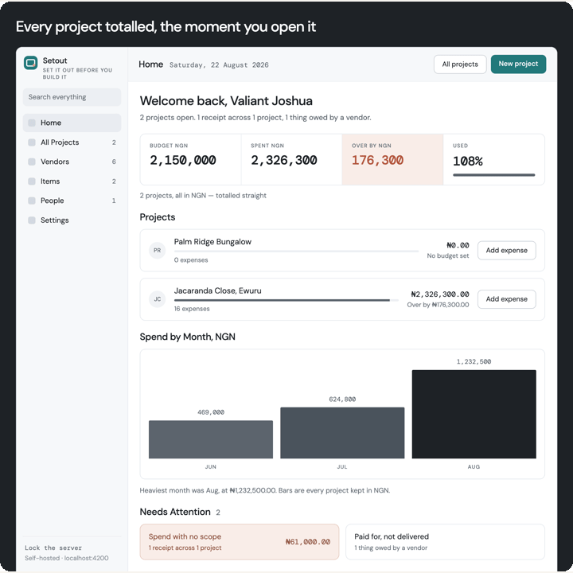
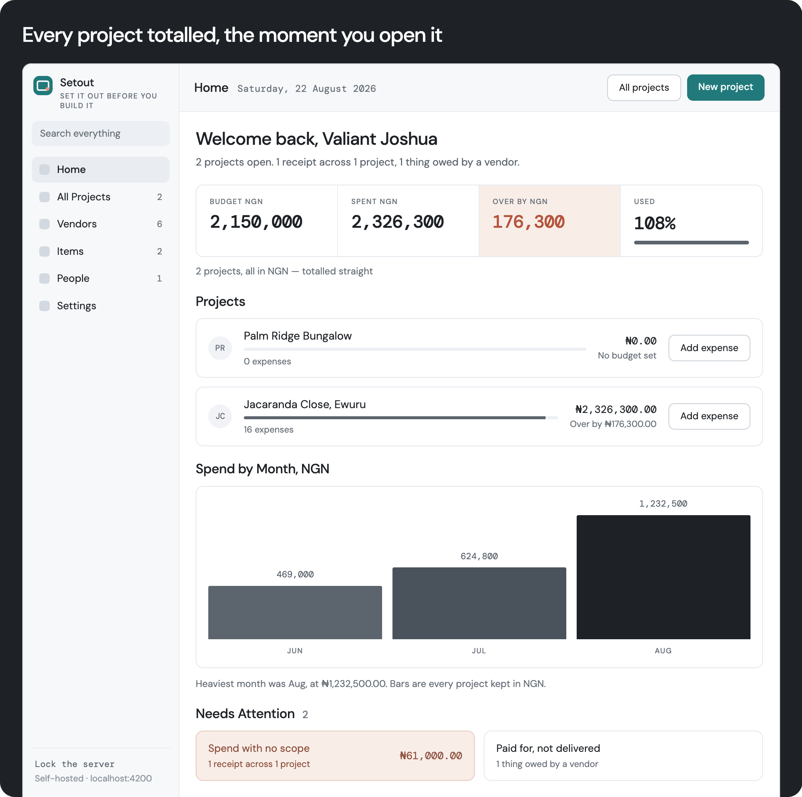
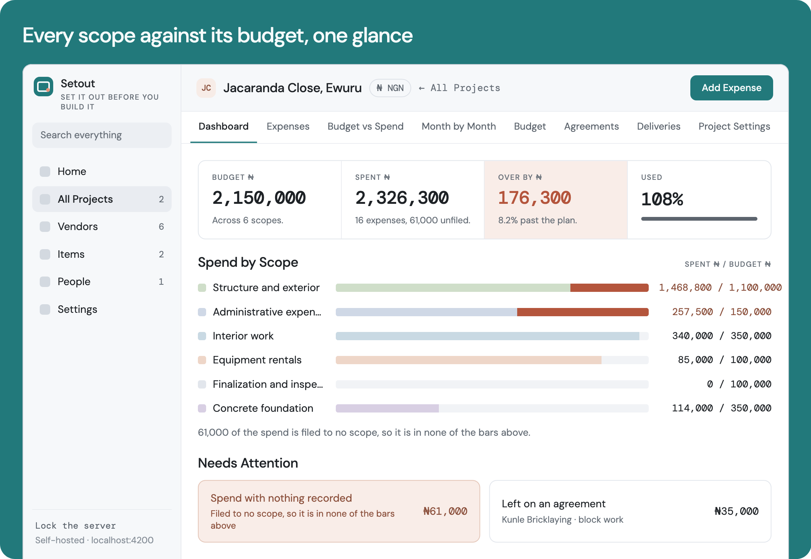
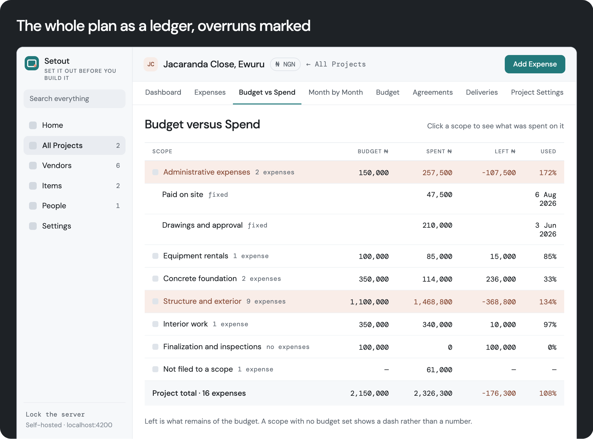
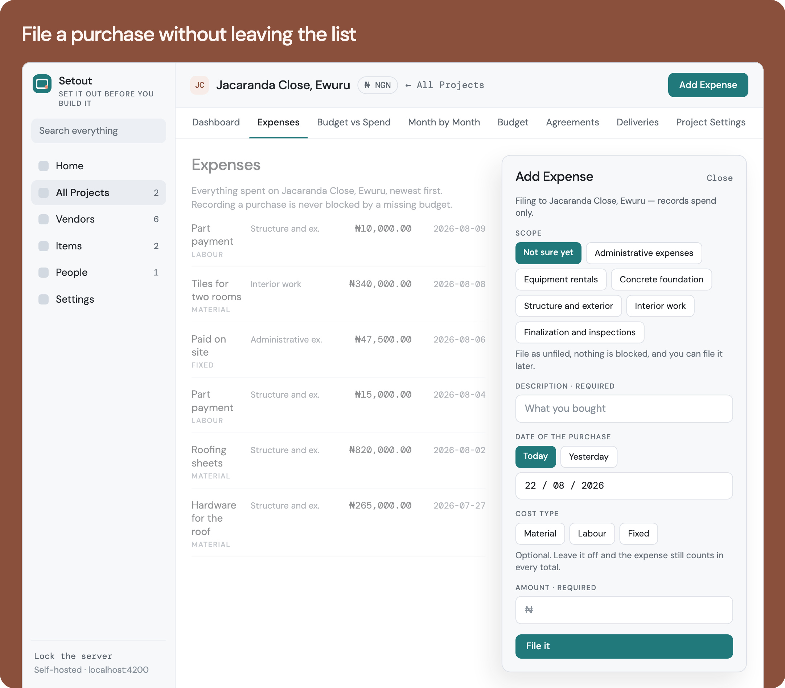

# Setout Showcase

Setout keeps construction spend visible while the work is still happening: set a
budget by scope, record purchases as they happen, and see where the money went.

  

## Home

The home screen totals every project without mixing currencies and surfaces the
items that need attention.

  

## Project dashboard

Each project shows its budget, spend, monthly movement, and outstanding items in
one place.

  

## Budget versus spend

Scopes keep planned costs separate from actual expenses, so the plan can be
adjusted without rewriting the record of what was spent.

  

## Add an expense

The essential fields stay short enough for a phone at the merchant's counter;
quantity, rate, scope, item, vendor, and payer are available when needed.

  

